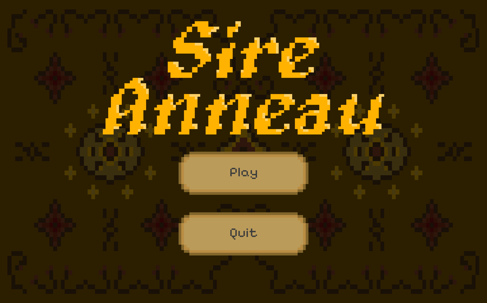
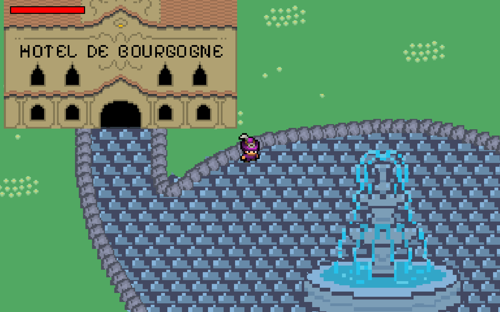
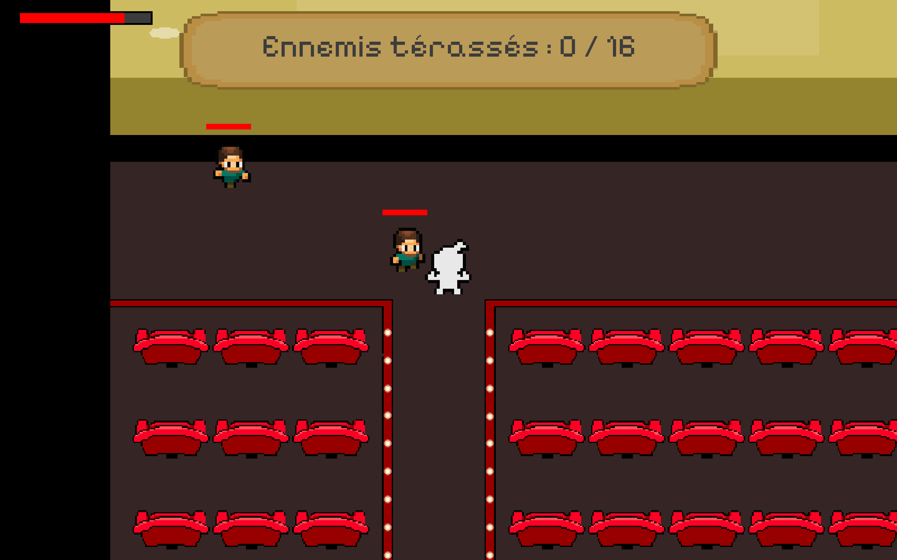

# Sire-Anneau Game

Sire-Anneau Game est un jeu d'action en 2D inspire de Cyrano de Bergerac. Le joueur incarne Cyrano et traverse plusieurs scenes emblematiques en affrontant des vagues d'ennemis, puis un boss propre a chaque lieu.

Le projet repose sur un moteur maison oriente composants : les scenes, prefabs, entites, collisions, animations, interfaces et comportements de gameplay sont assembles principalement depuis des fichiers XML.

## Apercu

## Concept

Le jeu melange beat'em up, hack'n slash leger et progression par scenes. Chaque zone propose une ambiance differente, des ennemis adaptes et un combat final.

Le ton du jeu reprend l'esprit de Cyrano : panache, duels, theatre, tirades et affrontements exageres.

## Scenes principales

### Theatre

Premiere arene du jeu. Cyrano affronte les ennemis dans une salle de theatre avant de combattre le boss Valvert.

### Balcon de Roxane

Scene plus intime et nocturne, centree autour du balcon de Roxane. Le joueur y affronte des vagues d'ennemis avant le combat contre le Capitaine.

### Siege d'Arras

Grande scene de bataille. Le joueur doit survivre a une pression plus forte, avec davantage d'ennemis simultanes, avant d'affronter le Commandant.

## Fonctionnalites

- Moteur 2D base sur des `GameObject` et des `Component`.
- Scenes et prefabs declaratifs en XML.
- Systeme de collisions, triggers et zones de chargement.
- Animation par arbres d'animation et parametres.
- Controleur joueur, ennemis, boss et spawners.
- Bossfights avec vagues d'ennemis, compteur de progression et HUD dedie.
- Interface TGUI : menu principal, pause, game over, barre de vie et boite de dialogue.

## Structure

- `src/engine/` : moteur de jeu maison.
- `src/assets/scripts/` : scripts gameplay, UI, ennemis, boss et zones.
- `src/assets/resources/` : scenes, prefabs, textures, animations, polices et configuration.
- `src/test/` : tests unitaires du moteur et des systemes principaux.
- `uml/` : diagrammes PlantUML et exports.
